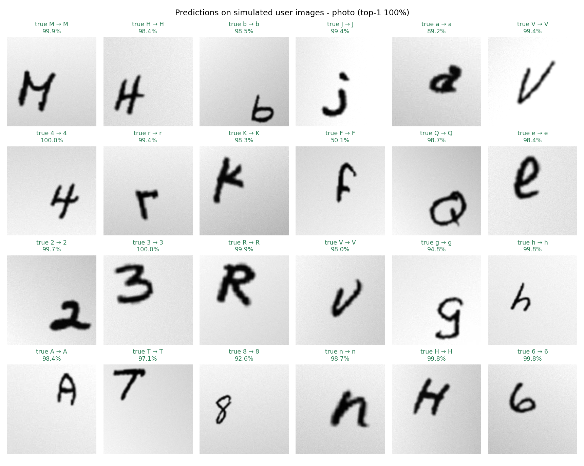
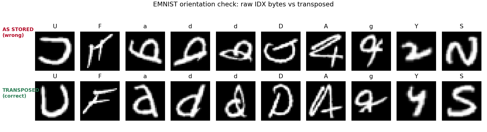
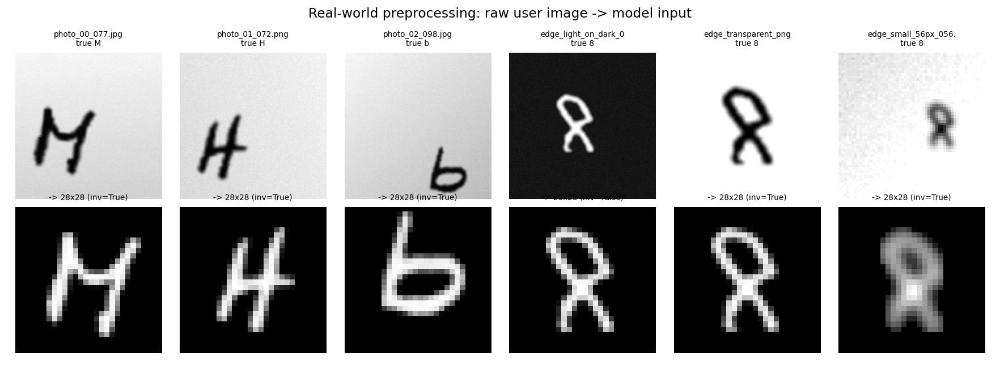
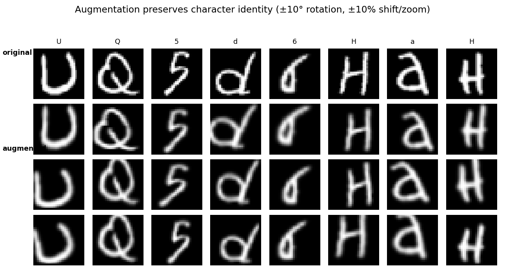

<div align="center">

# ✍️ Handwritten Character Recognition

**Recognise handwritten characters from photos, scans or your own drawing — with a CNN trained on EMNIST.**

[](https://www.python.org/)
[](https://www.tensorflow.org/)
[](https://scikit-learn.org/)
[](https://opencv.org/)
[](https://flask.palletsprojects.com/)
[](https://www.nist.gov/itl/products-and-services/emnist-dataset)

**47 character classes** · digits `0–9`, uppercase `A–Z`, lowercase `a b d e f g h n q r t`

</div>

---

## What this is

A complete computer-vision project — not a notebook that stops at a training curve.

It loads and **verifies** the EMNIST dataset, establishes classical baselines, trains a CNN
through a controlled experiment ladder, evaluates it on a genuinely untouched test set,
analyses what it gets wrong and why, exports the model, and serves it through a polished
web application that takes **real photographs** rather than only pre-cleaned dataset rows.

<table>
<tr>
<td width="50%" valign="top">

**🔬 Done properly**

- Dataset choice justified against 5 alternatives
- EMNIST orientation bug caught **by measurement**
- No data leakage — test set touched exactly once
- Label-preserving augmentation only
- Macro F1 reported, not just accuracy
- Confusions read from the real matrix

</td>
<td width="50%" valign="top">

**🚀 Actually usable**

- Draw a character, or upload a photo
- Confidence + top-5 alternatives
- Handles dark-on-light *and* light-on-dark
- Shows you the 28×28 the model really sees
- Light/dark themes, WCAG AA, responsive
- JSON API for programmatic use

</td>
</tr>
</table>

---

## Results

<!-- RESULTS:START -->
<div align="center">

### 🎯 90.01% accuracy &nbsp;·&nbsp; 89.90% macro F1

on **18,800 held-out test images** across **47 classes** — a test set the model never saw during training or model selection.

</div>

| Model | Accuracy | Precision | Recall | Macro F1 | Weighted F1 |
|:---|---:|---:|---:|---:|---:|
| Logistic regression | 64.85% | 64.64% | 64.85% | 64.66% | 64.66% |
| K-nearest neighbours (k=3) | 72.90% | 74.86% | 72.90% | 72.96% | 72.96% |
| Random forest (200 trees) | 77.39% | 77.38% | 77.39% | 77.13% | 77.13% |
| **🏆 CNN (final)** | **90.01%** | **90.36%** | **90.01%** | **89.90%** | **89.90%** |

The CNN beats the strongest classical baseline (Random forest (200 trees), 77.39%) by **12.62 percentage points** — an error reduction of **55.8%**. The baselines flatten each image into 784 independent pixels; the CNN's convolutions exploit the spatial structure they discard.

<details>
<summary><b>The experiment ladder</b> — each step changes exactly one thing</summary>

| Experiment | Question | Val accuracy | Train−val gap |
|:---|:---|---:|---:|
| Simple CNN | How far does a plain CNN get? | 88.05% | +0.39 pp |
| + BatchNorm | Does batch normalisation help? | 89.24% | +1.71 pp |
| + Dropout | Does dropout curb overfitting? | 89.80% | -2.00 pp |
| + Augmentation | Does augmentation generalise better? | 88.77% | -4.21 pp |
| + Depth & LR schedule | Does more depth + LR scheduling win? | 90.72% | -0.98 pp |

`Train−val gap` is training accuracy minus validation accuracy at the best epoch — the direct measure of overfitting. These are **validation** figures; the test set was still untouched at this stage.

</details>

<details>
<summary><b>What it gets wrong</b> — read from the real confusion matrix</summary>

| True | Predicted | Count | % of that class |
|:---:|:---:|---:|---:|
| `O` | `0` | 179 | 44.8% |
| `F` | `f` | 168 | 42.0% |
| `L` | `1` | 138 | 34.5% |
| `q` | `9` | 125 | 31.2% |
| `I` | `1` | 102 | 25.5% |
| `1` | `L` | 86 | 21.5% |
| `f` | `F` | 68 | 17.0% |
| `g` | `9` | 62 | 15.5% |

These are character pairs whose handwritten forms genuinely overlap when stripped of surrounding context — not arbitrary failures.


</details>

<details>
<summary><b>Is the confidence trustworthy?</b></summary>

| Statistic | Value |
|:---|---:|
| Mean confidence when **correct** | 93.66% |
| Mean confidence when **incorrect** | 64.72% |
| Accuracy when confidence ≥ 99% | 99.26% (covers 58.43% of the test set) |

The model is **28.9 percentage points** less confident when it is wrong, so a threshold can route uncertain characters to a human instead of silently guessing. The web app flags anything below 60% as uncertain.

</details>

<details>
<summary><b>On realistic photo-style images</b></summary>

| Image family | Count | Top-1 | Top-3 | Top-5 |
|:---|---:|---:|---:|---:|
| edge_case | 5 | 100.0% | 100.0% | 100.0% |
| font | 12 | 100.0% | 100.0% | 100.0% |
| photo | 24 | 100.0% | 100.0% | 100.0% |
| **Overall** | **41** | **100.0%** | **100.0%** | **100.0%** |

> These are simulated camera/scan renderings of unseen EMNIST test glyphs and printed-font glyphs, not photographs of a real person's handwriting. The 'font' family is deliberately out of distribution.



</details>

<sub>Selected on validation accuracy: `exp6_cnn_deep_aug_lr` · 595,791 parameters · TensorFlow 2.18.1 · 8 threads, CPU only · numbers generated by `src/update_readme.py`</sub>
<!-- RESULTS:END -->

---

## Quick start

```bash
python -m venv .venv
```

```bash
.venv\Scripts\python.exe -m pip install -r requirements.txt
```

```bash
.venv\Scripts\python.exe src\app.py
```

Open **<http://127.0.0.1:5000>** and draw a character.

> The EMNIST archive (536 MB) and MNIST (11 MB) download automatically on first use into
> `data/raw/`. Decoded arrays are cached in `data/processed/`, so later runs start instantly.

<details>
<summary><b>Reproduce the entire project from scratch</b></summary>

<br>

Run from the project root, in this order:

```bash
.venv\Scripts\python.exe src\explore.py
```
Dataset inspection, the orientation proof, and all EDA figures.

```bash
.venv\Scripts\python.exe src\baseline.py --dataset emnist_balanced
```
Logistic regression, KNN and random-forest reference points.

```bash
.venv\Scripts\python.exe src\train.py --experiment all --dataset emnist_balanced
```
The full experiment ladder. **This is the long step** — roughly 3 hours on CPU.

```bash
.venv\Scripts\python.exe src\finalize.py --dataset emnist_balanced
```
Selects the best model on validation, exports it, verifies the reload, then evaluates once on the test set.

```bash
.venv\Scripts\python.exe src\make_samples.py
```

```bash
.venv\Scripts\python.exe src\predict_samples.py
```

```bash
.venv\Scripts\python.exe src\make_report.py
```

```bash
.venv\Scripts\python.exe src\update_readme.py
```

The last two steps regenerate `report.md` and this file's **Results** section by
interpolating the metrics JSON, so neither can ever drift from the measured results.

</details>

---

## Using it

### 🖥️ Web app

```bash
.venv\Scripts\python.exe src\app.py
```

| | |
|---|---|
| **Draw** | Mouse, trackpad or touch. Undo and clear. |
| **Upload** | PNG/JPG, drag-and-drop or file picker. |
| **Result** | Predicted character, confidence, top-5 with real probabilities. |
| **Transparency** | Shows the preprocessed 28×28 the model actually received. |
| **Model page** | Real accuracy, macro F1, confusion pairs and training curves, loaded from `outputs/metrics/`. |

Nothing in the interface is hardcoded. If the evaluation hasn't been generated yet, those
panels say so rather than displaying a number.

### ⌨️ Command line

```bash
.venv\Scripts\python.exe src\inference.py --image path\to\your_character.jpg --top-k 5 --explain
```

```text
Predicted Character: G
Confidence: 91.4%

Top predictions:
  1. G  -  91.42%  ###########################
  2. C  -   4.21%  #
  3. O  -   2.08%  #
```

`--explain` also writes a figure showing every preprocessing stage next to the probability bars.

### 🐍 Python

```python
import sys; sys.path.insert(0, "src")
from inference import CharacterRecognizer

recognizer = CharacterRecognizer()
prediction = recognizer.predict_image("my_letter.png", top_k=5)

print(prediction.character, prediction.confidence)
print(prediction.top_k)
```

### 🔌 HTTP API

| Endpoint | Purpose |
|---|---|
| `GET /api/health` | Liveness, and which model is loaded |
| `GET /api/model-info` | Dataset, architecture and real test metrics |
| `POST /api/predict` | Canvas data-URL **or** multipart upload → prediction |
| `GET /api/figure/<key>` | Whitelisted evaluation figures |

```bash
curl -F "file=@samples/photo_01_072.png" http://127.0.0.1:5000/api/predict
```

Uploads are validated server-side by **decoding** the image rather than trusting the file
extension, and are capped at 8 MB and 8000 px per side.

---

## How it works

### The dataset trap that eats this project

EMNIST's IDX files store every image with the **row and column axes swapped** relative to
MNIST. Read naively, each character comes out mirrored and rotated 90°.

This is dangerous precisely because it is *silent*: a CNN will happily train to ~85%
accuracy on a consistently wrong orientation, so nothing in the loss curve tells you.

Rather than eyeballing it, the fix is chosen by **measurement**. EMNIST classes `0–9` are
the same digits as MNIST, so each candidate transform's mean digit images are correlated
against MNIST's — and the winner is decisive:



<div align="center"><i>Top: raw IDX bytes. Bottom: after the transpose. The metric and the picture agree.</i></div>

### A photo is not a dataset row

Dataset images are already 28×28, deslanted and centred by NIST. A photograph is none of
those things, so the inference pipeline rebuilds those conditions:

```text
grayscale → blur → Otsu threshold → polarity detection → largest blob
    → crop to ink → scale longest side to 20px → centre by centre of mass in 28×28
```

Polarity detection is why **dark ink on light paper and light ink on a dark background
both work** without asking the user: ink is whichever region is the minority.



### Architecture

```text
Input 28×28×1
  [Conv 3×3 → BatchNorm → ReLU] ×2 → MaxPool 2×2 → Dropout
  [Conv 3×3 → BatchNorm → ReLU] ×2 → MaxPool 2×2 → Dropout
  [Conv 3×3 → BatchNorm → ReLU] ×2 → MaxPool 2×2 → Dropout    (deep variant)
Flatten → Dense → BatchNorm → ReLU → Dropout → Dense(47) → Softmax
```

Trained with Adam, batch size 128, early stopping on validation loss with best-weight
restoration, and `ReduceLROnPlateau` for the final experiment.

### Augmentation that can't corrupt the labels

Only ±10° rotation and ±10% translation/zoom, applied to the **training split only**.

| Excluded | Why |
|---|---|
| Horizontal flip | `b`↔`d`, `p`↔`q` |
| Vertical flip | `M`↔`W`, `b`↔`p` |
| Rotation ≥ 45° | `6`↔`9`, `N`↔`Z` |



### No data leakage

The official EMNIST test split is **never** used for fitting, early stopping or model
selection. Validation is a stratified 10% carved out of the training split with a fixed
seed. `evaluate.py` is the only module that reads the test set, and it runs once — after
the final model has already been chosen.

---

## Why EMNIST Balanced

| Variant | Classes | Train | Verdict |
|---|---|---|---|
| MNIST | 10 | 60,000 | Digits only — too easy for the main task |
| EMNIST Digits | 10 | 240,000 | A larger MNIST; no character diversity |
| EMNIST Letters | 26 | 124,800 | Letters only, no digits |
| EMNIST ByClass | 62 | 697,932 | Most complete, but severely imbalanced and ~6× the compute |
| EMNIST ByMerge | 47 | 697,932 | Same classes as Balanced, but imbalanced and much larger |
| **EMNIST Balanced** | **47** | **112,800** | ✅ **Selected** |

1. **Genuinely a character task** — digits *and* letters, 47 classes.
2. **Exactly balanced** (2,400 train / 400 test per class), so accuracy and macro F1 measure
   real skill rather than a class prior.
3. **Case handled honestly.** Fifteen letters (C I J K L M O P S U V W X Y Z) have upper- and
   lowercase forms that are indistinguishable in isolation, so EMNIST merges them. Penalising
   a model for calling an isolated `o` an `O` would be measuring an impossible task.
4. **Computationally reasonable** on CPU, unlike the 698k-image variants.

---

## Project structure

```text
handwritten-character-recognition/
├── data/
│   ├── raw/                    # downloaded EMNIST zip + MNIST npz
│   └── processed/              # decoded, orientation-corrected .npz caches
│
├── src/
│   ├── utils.py                # paths, seeding, JSON helpers, environment info
│   ├── data_loader.py          # EMNIST/MNIST loading, orientation check, splits
│   ├── preprocessing.py        # dataset pipeline + real-world image pipeline
│   ├── augmentation.py         # label-preserving augmentation, tf.data pipelines
│   ├── models.py               # configurable CNN builder + named variants
│   ├── baseline.py             # logistic regression / KNN / random forest
│   ├── explore.py              # dataset inspection, orientation proof, EDA
│   ├── train.py                # experiment runner
│   ├── evaluate.py             # test metrics, confusion matrix, error analysis
│   ├── finalize.py             # model selection, export, reload verification
│   ├── inference.py            # CharacterRecognizer + CLI
│   ├── make_samples.py         # generates simulated user images
│   ├── predict_samples.py      # batch inference over those images
│   ├── make_report.py          # generates report.md from the metrics files
│   ├── update_readme.py        # regenerates this file's Results block
│   └── app.py                  # Flask web application
│
├── web/
│   ├── templates/index.html    # single-page UI
│   └── static/
│       ├── css/app.css         # design tokens + components
│       └── js/app.js           # canvas, uploader, results, model info
│
├── models/
│   ├── baseline/               # fitted sklearn baselines (.joblib)
│   └── final/
│       ├── handwritten_character_cnn.keras
│       ├── labels.json
│       └── preprocessing_config.json
│
├── notebooks/character_recognition.ipynb
├── outputs/{figures,metrics,predictions}/
├── samples/                    # simulated user images + manifest.json
├── report.md                   # full written report (generated)
├── requirements.txt
└── README.md
```

---

## Documentation

| Document | Contents |
|---|---|
| **[report.md](report.md)** | Full write-up: methodology, every experiment, evaluation, error analysis, CRNN extension |
| **[notebooks/character_recognition.ipynb](notebooks/character_recognition.ipynb)** | End-to-end walkthrough; loads saved metrics, so it renders real results without retraining |
| `outputs/metrics/` | Raw JSON for every number quoted anywhere in this repo |
| `outputs/figures/` | Every figure referenced above |

---

## FAQ

<details>
<summary><b>Why a CNN instead of a plain neural network?</b></summary>

<br>

A dense network flattens the image into 784 independent pixels, throwing away the fact that
neighbouring pixels form strokes. A convolution slides a small learned filter across the
image, so a stroke junction is detected the same way wherever it appears — the weights are
shared instead of relearned per position. That is also why the CNN beats the flattened-pixel
baselines by such a wide margin here.

</details>

<details>
<summary><b>What do batch normalisation and dropout actually do?</b></summary>

<br>

**Batch normalisation** re-centres and rescales activations between a convolution and its
activation function, which keeps the optimisation stable at a larger learning rate. (The
convolutions therefore carry no bias — BN's shift term replaces it.)

**Dropout** randomly removes units during training, so the network cannot lean on any single
feature and is forced to learn redundant evidence for each character. In this project it is
measurable: adding dropout turned the train−validation gap *negative*.

</details>

<details>
<summary><b>Why report macro F1 rather than accuracy?</b></summary>

<br>

Accuracy is a single average that a model can achieve while being excellent on easy classes
and poor on hard ones. **Macro F1** averages the per-class F1 scores with equal weight, so a
model that is superb on digits but weak on `q` cannot hide behind the mean. On EMNIST
Balanced the class supports are equal, so macro and weighted F1 land close together — on an
imbalanced dataset they would diverge sharply, which is exactly when macro F1 earns its keep.

</details>

<details>
<summary><b>Why does it confuse certain characters?</b></summary>

<br>

Because those characters genuinely overlap when written by hand and stripped of context —
`L`/`1`, `0`/`O`, `f`/`F`, `q`/`9`. A human shown the same isolated glyph, with no
surrounding word to disambiguate it, would often make the same call. The confusions reported
in `report.md` are read from the actual confusion matrix, never assumed.

Fixing them needs *context*, which is the motivation for the CRNN extension below rather
than a deeper convolutional stack.

</details>

<details>
<summary><b>Can it read whole words or sentences?</b></summary>

<br>

Not yet — and deliberately not faked. The honest extension is a **CRNN trained with CTC
loss**, not slicing a word image into letters and running this classifier on each piece
(segmentation is exactly what breaks on cursive and touching characters).

```text
Word image → CNN features → sequence of frames → BiLSTM → CTC loss / decode
```

CTC solves the alignment problem: the network emits a fixed number of frames but the target
word has a different, variable length, and nobody labels which pixel column each letter
starts at. CTC sums probability over every valid alignment, so the model learns alignment
implicitly from `(image, "hello")` pairs alone.

It is documented rather than implemented because it needs a word-level dataset (IAM, which
requires a registered download) and roughly an order of magnitude more compute than was
available here. See §18 of [report.md](report.md).

</details>

---

## Limitations

- **Single characters only** — no word or sentence recognition.
- **Case is partially unrecoverable by design** — 15 letters are case-merged by EMNIST
  Balanced, so the model cannot report whether an isolated `s` was upper- or lowercase.
- **Domain limits** — trained on NIST-style handwriting; cursive joins, unusual scripts and
  printed type are out of distribution.
- **One character per image** — preprocessing isolates the largest connected blob, so an
  image with two characters, or a character broken into disconnected strokes, may crop wrong.
- **The bundled `samples/` set is simulated** — renderings of unseen EMNIST test glyphs and
  printed fonts, not photographs of real handwriting. Use the web app or CLI to test genuinely
  new input.
- **Trained on CPU**, which capped the experiment budget.

---

<div align="center">

Built with Python, TensorFlow/Keras, OpenCV and scikit-learn.

*Every number in this repository comes from an executed run. Nothing is hand-entered.*

</div>
