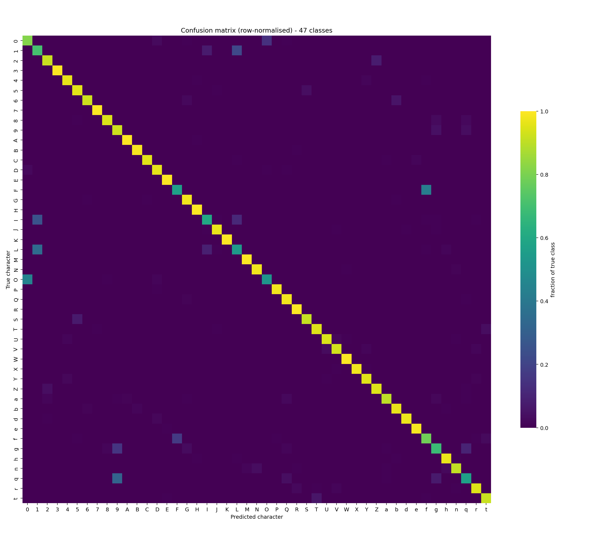
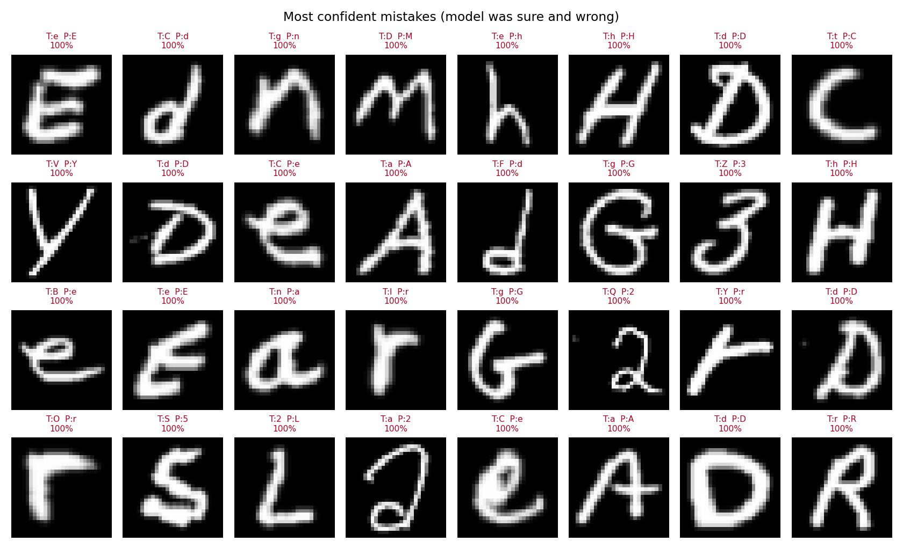
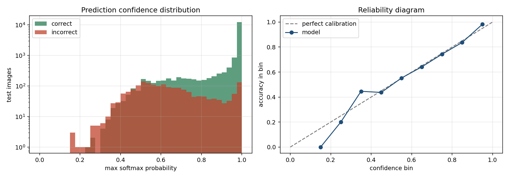

# Handwritten Character Recognition with a Convolutional Neural Network

*Generated from executed results on 2026-09-05.*

Every number in this report is read directly from the JSON metrics files written by the training and evaluation scripts. Nothing is hand-entered.

---

## 1. Introduction

Handwritten character recognition is the task of mapping an image of a single handwritten symbol to its identity. It is the classical proving ground for computer vision because handwriting is high-variance: the same letter written by two people — or by the same person twice — differs in slant, stroke thickness, proportion and closure, yet must map to one label.

This project builds and evaluates a convolutional neural network (CNN) that recognises 47 character classes, and wraps it in an inference system that accepts real photographs and drawings rather than only pre-cleaned dataset images.

## 2. Problem Statement

Given a grayscale image containing one handwritten character, predict which character it is and report a calibrated confidence. The system must work on images that do not resemble the training distribution's formatting — arbitrary size, arbitrary background, off-centre placement, and either dark ink on light paper or light ink on a dark background.

## 3. Objectives

1. Select and justify an appropriate handwritten-character dataset.
2. Verify the data is loaded and oriented correctly before training on it.
3. Establish a classical machine-learning baseline for comparison.
4. Train a CNN and improve it through controlled, one-variable-at-a-time experiments.
5. Evaluate on a held-out test set using macro-averaged metrics, not accuracy alone.
6. Analyse which characters the model confuses and why.
7. Export the model and perform inference on genuinely unseen images.

## 4. Dataset

**EMNIST Balanced** is the main dataset; **MNIST** is used as an easier reference point so the difficulty gap is measured rather than asserted.

| | MNIST | EMNIST Balanced |
|---|---|---|
| Training images | 60,000 | 112,800 |
| Test images | 10,000 | 18,800 |
| Classes | 10 | 47 |
| Image size | 28×28 | 28×28 |
| Per-class train count | 5,421–6,742 | 2,400 (exactly balanced) |
| Imbalance ratio | 1.24 | 1.00 |

### Why EMNIST Balanced

| Variant | Classes | Train | Verdict |
|---|---|---|---|
| MNIST | 10 | 60,000 | Digits only — too easy to be the main task. |
| EMNIST Digits | 10 | 240,000 | A larger MNIST; no character diversity. |
| EMNIST Letters | 26 | 124,800 | Letters only, no digits, case fully merged. |
| EMNIST ByClass | 62 | 697,932 | Most complete, but severely imbalanced and ~6× the compute. |
| EMNIST ByMerge | 47 | 697,932 | Same classes as Balanced, but imbalanced and much larger. |
| **EMNIST Balanced** | **47** | **112,800** | **Selected.** |

1. **It is genuinely a character task** — digits *and* letters across 47 classes, not a digits-only problem.
2. **Exactly balanced.** Every class has the same number of training and test images, so accuracy and macro-F1 measure real discriminative skill rather than a class prior. Any weakness in the results is therefore a property of the characters, not of the sampling.
3. **Case is handled honestly.** Fifteen letters (C I J K L M O P S U V W X Y Z) have upper- and lowercase forms that are indistinguishable in isolation, so EMNIST merges them. Penalising a model for calling an isolated `o` an `O` would be measuring an impossible task.
4. **Computationally reasonable** on the CPU-only machine used here, unlike the 698k-image ByClass and ByMerge variants.

Class set: `0 1 2 3 4 5 6 7 8 9 A B C D E F G H I J K L M N O P Q R S T U V W X Y Z a b d e f g h n q r t`

## 5. Dataset Analysis

Computed from the loaded arrays: pixel values are `uint8` in [0, 255], with mean 44.65 and standard deviation 84.98. The intensity histogram is strongly bimodal — a large pure-black background mode and a bright ink mode — confirming the images are already background-normalised.

### The EMNIST orientation trap

EMNIST's IDX files store each image with the row and column axes **swapped** relative to MNIST. Read naively, every character comes out mirrored and rotated 90°. This is dangerous precisely because it is silent: a CNN will still train to ~85% accuracy on consistently wrong orientation, so the bug does not announce itself in the loss curve.

Rather than trusting a visual impression, the orientation was chosen by measurement. EMNIST classes 0–9 are the same digits as MNIST, so for each candidate transform the mean image of every digit class was correlated against MNIST's:

| Candidate transform | Mean correlation with MNIST |
|---|---|
| `transpose` **← selected** | +0.7977 |
| `rot90_cw` | +0.6350 |
| `rot90_ccw` | +0.6223 |
| `as_stored` | +0.4591 |
| `flip_ud` | +0.4120 |
| `flip_lr` | +0.4049 |

`transpose` wins decisively. The fix was then confirmed visually (`outputs/figures/phase3_orientation_check.png`), so the decision rests on both a metric and an inspection.

## 6. Preprocessing

Two pipelines exist, and they must agree at the point of prediction.

**Dataset pipeline.** EMNIST images are already 28×28, deslanted, size-normalised and centred by NIST, so they need only the orientation transpose, scaling to `[0, 1]`, and a channel axis giving `(N, 28, 28, 1)`. They are deliberately *not* upscaled: at 28×28 a stroke is 2–3 px wide, so resizing to 224×224 adds no information, blurs the strokes, and multiplies the compute by roughly 64× for nothing.

**Real-world pipeline.** A photograph is not EMNIST-like, so it is reconstructed into NIST conditions:

1. Grayscale (transparency composited onto white).
2. 3×3 Gaussian blur to suppress sensor and JPEG noise.
3. Otsu threshold — the cut point is derived from the image's own histogram.
4. Polarity detection: ink is the *minority* region, so dark-on-light and light-on-dark both work without asking the user.
5. Largest connected component, discarding specks and paper grain.
6. Crop to the ink bounding box.
7. Resize so the longest side is 20 px, preserving aspect ratio.
8. Centre by centre of mass in a 28×28 frame — the same procedure NIST used to build MNIST and EMNIST.
9. Scale to `[0, 1]`.

## 7. Data Augmentation

Augmentation is restricted to transforms that **cannot change the label**: ±10° rotation, ±10% translation and ±10% zoom, applied to the training split only. Validation and test data are never augmented.

| Excluded transform | Why it would corrupt the labels |
|---|---|
| Horizontal flip | `b`↔`d`, `p`↔`q` |
| Vertical flip | `M`↔`W`, `b`↔`p` |
| Rotation ≥ 45° | `6`↔`9`, `N`↔`Z` |
| Heavy shear | destroys thin-stroke letters |

This matters more for EMNIST than for MNIST: a digits-only dataset has fewer label-flipping symmetries than a 47-class alphabet does.

## 8. CNN Architecture

```
Input 28×28×1
  [Conv 3×3 → BatchNorm → ReLU] ×2 → MaxPool 2×2 → Dropout
  [Conv 3×3 → BatchNorm → ReLU] ×2 → MaxPool 2×2 → Dropout
  [Conv 3×3 → BatchNorm → ReLU] ×2 → MaxPool 2×2 → Dropout   (deep variant)
Flatten → Dense → BatchNorm → ReLU → Dropout → Dense(47) → Softmax
```

The selected model (`deep`) has **595,791 parameters** (594,383 trainable).

Design rationale: **convolution** exploits the fact that a stroke junction means the same thing wherever it appears, so filters are shared across the image instead of learning a separate weight per pixel. **ReLU** is used because it does not saturate for positive inputs, so gradients survive depth. **Batch normalisation** sits between each convolution and its activation, re-centring activations so a larger learning rate stays stable (the convolutions therefore carry no bias — BN's shift term replaces it). **Max pooling** halves the resolution, giving tolerance to small shifts and widening the receptive field. **Dropout** randomly removes units during training so the network cannot rely on any single feature. **Softmax** turns the final scores into a probability distribution over the classes, which is what makes the confidence figure meaningful.

## 9. Training Methodology

| Setting | Value |
|---|---|
| Optimiser | Adam |
| Learning rate | 0.001 |
| Batch size | 128 |
| Max epochs | 25 |
| Epochs actually run | 25 |
| Early stopping patience | 5 (on validation loss) |
| Validation split | 10% of train, stratified |
| Random seed | 42 |

### Preventing data leakage

The official EMNIST test split (18,800 images) is never used for fitting, early stopping, or model selection. Validation is a stratified 10% carved out of the training split with a fixed seed, yielding 101,520 training and 11,280 validation images. Model selection used validation accuracy only; `evaluate.py` is the sole module that reads the test set, and it ran once, after the final model was chosen.

### Hardware

Python 3.12.10, TensorFlow 2.18.1, 8 CPU threads, **no GPU** (`Intel64 Family 6 Model 140 Stepping 1, GenuineIntel`). This constrained the experiment budget: epoch times ranged from roughly 80 to 260 seconds, so early stopping and a modest epoch cap were necessary rather than optional.

## 10. Experiments

Each experiment changes exactly one component relative to the previous one, so the comparison isolates that component's effect. All figures below are **validation** results — the test set was still untouched at this stage.

| # | Experiment | Params | Epochs | Val accuracy | Val loss | Train−val gap |
|---|---|---|---|---|---|---|
| 2 | Simple CNN (no BN, no dropout) | 472,591 | 8 | 88.05% | 0.3294 | +0.39 pp |
| 3 | CNN + BatchNorm | 473,551 | 10 | 89.24% | 0.3082 | +1.71 pp |
| 4 | CNN + BatchNorm + Dropout | 473,551 | 12 | 89.80% | 0.2767 | -2.00 pp |
| 5 | CNN + BN + Dropout + Augmentation | 473,551 | 14 | 88.77% | 0.3117 | -4.21 pp |
| 6 | Deeper CNN + Augmentation + LR schedule | 595,791 | 25 | 90.72% | 0.3298 | -0.98 pp |

The `train−val gap` column is the direct measure of overfitting: training accuracy minus validation accuracy at the best epoch.

- **Simple CNN (no BN, no dropout)** — How far does a plain CNN (no BN, no dropout) get?
- **CNN + BatchNorm** — Does batch normalisation help optimisation/accuracy?
- **CNN + BatchNorm + Dropout** — Does dropout reduce the train/validation gap?
- **CNN + BN + Dropout + Augmentation** — Does label-preserving augmentation improve generalisation?
- **Deeper CNN + Augmentation + LR schedule** — Does a deeper model with LR scheduling beat exp5?

### MNIST reference point

The same architecture trained on MNIST reached **99.22% validation accuracy** across 10 classes, against 90.72% on EMNIST Balanced across 47. That gap is the quantitative answer to "why is EMNIST harder than MNIST?" — more classes, and several of them are near-duplicates of one another.

## 11. Evaluation Metrics

- **Accuracy** — the fraction of test images classified correctly. Adequate here only because the classes are balanced.
- **Precision** (per class) — of the images predicted as this character, how many really were. Penalises over-prediction.
- **Recall** (per class) — of the images that really are this character, how many were found. Penalises under-prediction.
- **F1** — the harmonic mean of precision and recall, so a class scores well only if both are good.
- **Macro F1** — the unweighted mean of the per-class F1 scores. Every character counts equally, so a model that is excellent on digits and poor on `q` cannot hide behind an average. **This is the headline metric.**
- **Weighted F1** — averaged by class support. Because EMNIST Balanced has equal support everywhere, it comes out close to macro F1; on an imbalanced dataset the two would diverge sharply.

## 12. Results

Final model evaluated on the untouched test set of 18,800 images.

| Model | Accuracy | Precision (macro) | Recall (macro) | Macro F1 | Weighted F1 |
|---|---|---|---|---|---|
| Logistic regression | 64.85% | 64.64% | 64.85% | 64.66% | 64.66% |
| K-nearest neighbours (k=3) | 72.90% | 74.86% | 72.90% | 72.96% | 72.96% |
| Random forest (200 trees) | 77.39% | 77.38% | 77.39% | 77.13% | 77.13% |
| **CNN — Deeper CNN + Augmentation + LR schedule** | **90.01%** | **90.36%** | **90.01%** | **89.90%** | **89.90%** |

The CNN beats the strongest baseline (Random forest (200 trees), 77.39%) by **12.62 percentage points**, cutting the error rate by **55.8%**. The baselines flatten each image into 784 independent pixels, discarding the spatial relationships that define a character; the CNN's convolutions are built to exploit exactly those.

The model misclassified 1,879 of 18,800 test images (error rate 9.99%).

## 13. Confusion Matrix



Each row is a true character and each column a prediction, row-normalised. The confusions below are read from that matrix — they are what the model actually did, not a list of characters that look similar in principle.

| True | Predicted | Count | % of that class |
|---|---|---|---|
| `O` | `0` | 179 | 44.8% |
| `F` | `f` | 168 | 42.0% |
| `L` | `1` | 138 | 34.5% |
| `q` | `9` | 125 | 31.2% |
| `I` | `1` | 102 | 25.5% |
| `1` | `L` | 86 | 21.5% |
| `f` | `F` | 68 | 17.0% |
| `g` | `9` | 62 | 15.5% |
| `0` | `O` | 56 | 14.0% |
| `I` | `L` | 45 | 11.2% |
| `g` | `q` | 39 | 9.8% |
| `L` | `I` | 35 | 8.8% |

### Hardest classes by per-class F1

| Character | F1 | Precision | Recall | Support |
|---|---|---|---|---|
| `L` | 0.571 | 0.609 | 0.537 | 400 |
| `1` | 0.612 | 0.540 | 0.705 | 400 |
| `O` | 0.626 | 0.780 | 0.522 | 400 |
| `F` | 0.648 | 0.761 | 0.565 | 400 |
| `q` | 0.650 | 0.751 | 0.573 | 400 |
| `I` | 0.678 | 0.779 | 0.600 | 400 |
| `f` | 0.702 | 0.636 | 0.785 | 400 |
| `0` | 0.710 | 0.631 | 0.812 | 400 |

The weakest class is `L` (F1 0.571), and the single most frequent confusion is `O` → `0` (179 of 400 images, 44.8% of that class). These are not arbitrary failures: they are pairs whose handwritten forms genuinely overlap, and a human reading the same isolated glyph without surrounding words would often make the same call.

## 14. Error Analysis



The figure above shows the errors the model was *most confident* about — the systematic failures, where the written glyph genuinely resembles the wrong class. A random sample of errors (`outputs/figures/final_errors_random.png`) shows the more typical mode: ambiguous, rushed or unusually proportioned handwriting.

Recurring causes, from inspecting the misclassified images:

- **Genuinely ambiguous glyphs** — the dominant cause; case-merged and visually overlapping characters written without context.
- **Unclosed or over-closed loops** — turning `a` into `u`-like or `o`-like shapes.
- **Extreme stroke weight** — very thick strokes fill in counters (the enclosed gaps), very thin ones fragment after downsampling to 28×28.
- **Unusual personal style** — serifs, exaggerated slant, or continental conventions such as a crossed `7`.

## 15. Confidence Analysis



| Statistic | Value |
|---|---|
| Mean confidence when correct | 93.66% |
| Mean confidence when incorrect | 64.72% |
| Predictions below 50% confidence | 3.66% |
| Accuracy when confidence ≥ 99% | 99.26% (covers 58.43% of the test set) |

The model is markedly less confident when it is wrong — a 28.9 percentage-point separation in mean confidence. That is the property a deployed system needs: a confidence threshold can route uncertain characters to a human instead of silently guessing. The web interface uses this directly, flagging any prediction below 60% as uncertain.

## 16. Model Comparison and Final Model

**Selected: `exp6_cnn_deep_aug_lr` — Deeper CNN + Augmentation + LR schedule**, chosen by the highest validation accuracy (90.72%) before the test set was consulted.

| Property | Value |
|---|---|
| Architecture variant | `deep` |
| Total parameters | 595,791 |
| Trainable parameters | 594,383 |
| Augmentation | enabled |
| Test accuracy | 90.01% |
| Test macro F1 | 89.90% |

### Reload verification

The exported `.keras` file was reloaded into a fresh object and compared against the source model on 256 test images. Maximum absolute difference in predicted probabilities: `0.000e+00`; predicted labels identical: `True`. The export is therefore lossless, not merely assumed to be.

## 17. Inference System

Three ways to use the trained model, all sharing one preprocessing path:

1. **Web application** (`python src/app.py`) — draw a character or upload a photo, and see the prediction, confidence, top-5 alternatives, and the 28×28 image the model actually received.
2. **Command line** (`python src/inference.py --image path.jpg --top-k 5`).
3. **Python API** — `CharacterRecognizer` from `src/inference.py`.

Exported artefacts in `models/final/`:

- `handwritten_character_cnn.keras` — the trained network
- `labels.json` — class index → character mapping, plus the test metrics
- `preprocessing_config.json` — the exact preprocessing contract

### Results on simulated user images

| Image family | Count | Top-1 | Top-3 | Top-5 |
|---|---|---|---|---|
| edge_case | 5 | 100.0% | 100.0% | 100.0% |
| font | 12 | 100.0% | 100.0% | 100.0% |
| photo | 24 | 100.0% | 100.0% | 100.0% |
| **Overall** | **41** | **100.0%** | **100.0%** | **100.0%** |

> These are simulated camera/scan renderings of unseen EMNIST test glyphs and printed-font glyphs, not photographs of a real person's handwriting. The 'font' family is deliberately out of distribution.

A worked example, straight from the model:

```
Image           : photo_00_077.jpg
True label      : M
Predicted       : M
Confidence      : 99.9%
Top predictions :
  1. M  —  99.87%
  2. n  —   0.05%
  3. H  —   0.04%
  4. N  —   0.02%
  5. U  —   0.01%
```

## 18. CRNN Extension and Future Work

**Status: documented as future work, not implemented.**

The brief allows extending the system to full words or sentences with sequence modelling. The honest way to do that is *not* to slice a word image into letters and run this classifier on each piece — segmentation is exactly what breaks on cursive and touching characters, and a segment-then-classify prototype would look like word recognition while failing on real handwriting.

The correct architecture is a **CRNN trained with CTC loss**:

```
Word image (H × W × 1, variable width)
  → CNN feature extractor        (collapses height, preserves width)
  → reshape into a left-to-right sequence of frames
  → BiLSTM / BiGRU               (each frame sees both directions of context)
  → Dense(vocabulary + 1 blank) → per-frame softmax
  → CTC loss (training) / CTC decode (inference)
```

**Why CTC is the key piece.** The network emits a fixed number of frames (say 64) but the target word has a different, variable length (say 5), and nobody has labelled which pixel column each letter begins at. CTC sums the probability over *every* alignment of frames to the target string — introducing a special *blank* symbol and collapsing repeated predictions — so the model learns the alignment implicitly from `(image, "hello")` pairs alone. Sequence modelling also buys context: an RNN can use the surrounding letters to resolve an ambiguous glyph, which is precisely the information this character classifier lacks.

**Why it was not implemented here.** It requires a word-level dataset (IAM Handwriting, which needs a registered download), and CRNN+CTC training costs roughly an order of magnitude more than this CNN — impractical on a CPU-only machine. Per the brief, a complete and verified character system is worth more than a half-trained word system, so the extension is specified rather than faked.

## 19. Limitations

- **Single characters only.** No word or sentence recognition.
- **Case is partially unrecoverable by design.** Fifteen letters are case-merged in EMNIST Balanced, so the model cannot report whether an isolated `s` was upper- or lowercase.
- **9.99% of test images are still misclassified**, concentrated in the visually overlapping classes listed in §13.
- **Domain limits.** Training data is NIST-style handwriting. Cursive joins, unusual scripts and printed type are out of distribution.
- **Preprocessing assumes one character per image**, isolated by the largest connected component. An image containing two characters, or a character broken into disconnected strokes, may be cropped incorrectly.
- **The bundled `samples/` set is simulated** — renderings of unseen EMNIST test glyphs and printed fonts, not photographs of real handwriting.
- **CPU-only training** capped the experiment budget; a longer schedule or wider architecture search would likely add a further increment of accuracy.

## 20. Conclusion

A convolutional neural network was trained to recognise 47 handwritten character classes, reaching **90.01% accuracy** and **89.90% macro F1** on 18,800 held-out test images — 12.62 percentage points above the strongest classical baseline, an error reduction of 55.8%.

Three things mattered more than model size. First, **verifying the data**: the EMNIST orientation bug is silent and would have quietly capped the result. Second, **controlled experiments**: batch normalisation, dropout and augmentation were each adopted because a one-variable comparison showed they helped, not because they are conventional. Third, **matching preprocessing to reality**: reconstructing NIST's centre-of-mass normalisation is what lets the model work on a photograph rather than only on curated dataset rows.

The remaining errors are concentrated in character pairs whose handwritten forms genuinely overlap. Resolving those requires context — the surrounding letters of a word — which is the motivation for the CRNN extension described in §18 rather than a deeper convolutional stack.

---

*Reproduce: see `README.md`. Raw metrics: `outputs/metrics/`. Figures: `outputs/figures/`.*
